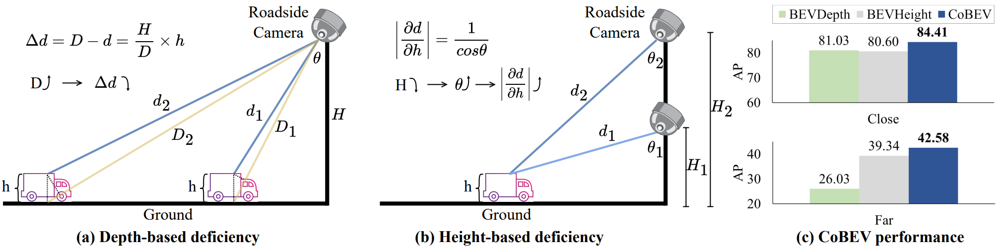

<p align="center">

  <h1 align="center">CoBEV: Elevating roadside 3d object detection with depth and height complementarity</h1>
  <p align="center">
    <a href="https://scholar.google.com/citations?hl=zh-CN&user=0EI9msQAAAAJ"><strong>Hao Shi</strong></a>
    ·
    <a href="https://ieeexplore.ieee.org/author/316959804579294"><strong>Chengshan Pang</strong></a>
    ·
    <a href="https://scholar.google.com/citations?hl=zh-CN&user=8diau40AAAAJ"><strong>Jiaming Zhang</strong></a>
    ·
    <a href="https://scholar.google.com/citations?hl=zh-CN&user=pKFqWhgAAAAJ"><strong>Kailun Yang</strong></a>
    ·
    <a href="https://ieeexplore.ieee.org/author/37089739214"><strong>Yuhao Wu</strong></a>
    ·
    <a href="https://ieeexplore.ieee.org/author/37089994240"><strong>Huajian Ni</strong></a>
    ·
    <a href="https://ieeexplore.ieee.org/author/37089950172"><strong>Yining Lin</strong></a>
    ·
    <a href="https://scholar.google.com/citations?hl=zh-CN&user=SFCOJxMAAAAJ"><strong>Rainer Stiefelhagen</strong></a>
    ·
    <a href="https://scholar.google.com/citations?hl=zh-CN&user=B6xWNvgAAAAJ"><strong>Kaiwei Wang</strong></a>
  </p>

<h2 align="center">IEEE T-IP 2024</h2>
  <div align="center">
    
  </div>

<p align="center">
    <br>
    <a href="https://paperswithcode.com/sota/3d-object-detection-on-dair-v2x-i?p=cobev-elevating-roadside-3d-object-detection">
      
    </a><br>
    <a href="https://paperswithcode.com/sota/3d-object-detection-on-rope3d?p=cobev-elevating-roadside-3d-object-detection">
      
    </a><br>
    <a href="https://pytorch.org/get-started/locally/"></a>
    <a href="https://pytorchlightning.ai/"></a>
    <br>
    <a href="https://arxiv.org/pdf/2310.02815">
      
    </a>
</p>

**CoBEV** (Complementary-BEV) is a new end-to-end monocular 3D object detector that integrates geometry-centric depth and semantic-centric height cues to construct robust BEV representations for roadside perception. 
CoBEV outperforms BEVHeight with a margin of 3.80% / 7.92% /6.09% across Vehicle, Pedestrian and Cyclist on **DAIR-V2X-I**. 
In scenarios where camera parameters are directly perturbed by noise affecting focal length, roll, and pitch, CoBEV exhibits an enhanced detection capability, surpassing BEVHeight by an average of 3.93%. 
Our goal is to enhance the perception range of intelligent vehicles and improve the responsiveness of the overall transportation system by constructing robust features within a unified BEV space.

# Memo

- [x] Release the pretrained models

<br>

<!-- TABLE OF CONTENTS -->
<details open="open" style='padding: 10px; border-radius:5px 30px 30px 5px; border-style: solid; border-width: 1px;'>
  <summary>Table of Contents</summary>
  <ol>
    <li>
      <a href="#Getting Started">Getting Started</a>
    </li>
    <li>
      <a href="#Model Zoo">Model Zoo</a>
    </li>
    <li>
      <a href="#Acknowledgment">Acknowledgment</a>
    </li>
    <li>
      <a href="#Citation">Citation</a>
    </li>
  </ol>
</details>

<br/>

# Getting Started

- [Installation](docs/install.md)
- [Prepare Dataset](docs/prepare_dataset.md)

Train CoBEV with 8 GPUs
```
python [EXP_PATH] --amp_backend native -b 8 --gpus 8
```
Eval CoBEV with 8 GPUs
```
python [EXP_PATH] --ckpt_path [CKPT_PATH] -e -b 8 --gpus 8
```

# Model Zoo
The pretrained models can be found via the following links:
* [BaiduYun](https://pan.baidu.com/s/1dYYYV2_WdnMyS-gXtZt6Yw?pwd=CBEV)
* [Google Drive](https://drive.google.com/drive/folders/1Pnem72i983qNqf5hptwx5cKBZqK-QSOW?usp=sharing)

# Acknowledgment
This project is developed based on the code of the following projects.
* [BEVHeight](https://github.com/ADLab-AutoDrive/BEVHeight)
* [BEVDepth](https://github.com/Megvii-BaseDetection/BEVDepth)
* [LSS](https://github.com/nv-tlabs/lift-splat-shoot)
* [DAIR-V2X](https://github.com/AIR-THU/DAIR-V2X)

# Citation
If our work is helpful to you, please consider citing us by using the following BibTeX entry:
```
@article{shi2024cobev,
  title={Cobev: Elevating roadside 3d object detection with depth and height complementarity},
  author={Shi, Hao and Pang, Chengshan and Zhang, Jiaming and Yang, Kailun and Wu, Yuhao and Ni, Huajian and Lin, Yining and Stiefelhagen, Rainer and Wang, Kaiwei},
  journal={IEEE Transactions on Image Processing},
  year={2024},
  publisher={IEEE}
}
```
